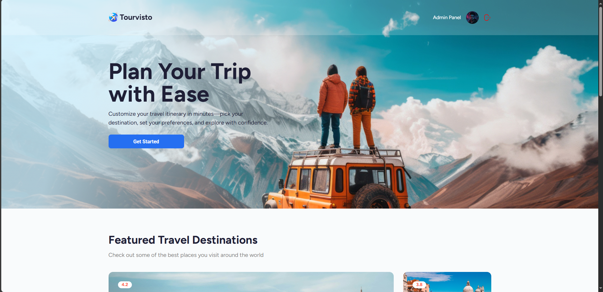
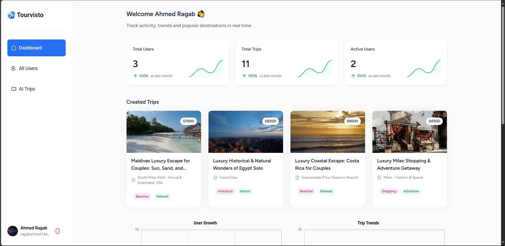
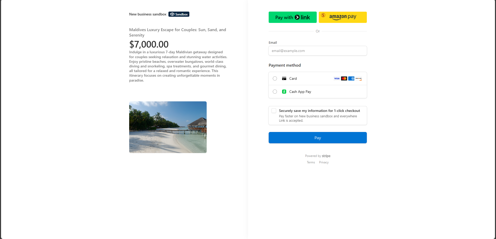

<div align="center">
  <br />
      
  <br />
  <div>
    
    
    
    
  </div>
  <h3 align="center">Travel Agency Platform</h3>
</div>

## <a name="introduction">🤖 Introduction</a>

A full-featured travel booking web app with a modern public site and admin dashboard. Users can generate AI-based trip itineraries tailored by country, interests, travel style, group type, and budget — then book trips effortlessly.

## <a name="tech-stack">⚙️ Tech Stack</a>

- React 19 + React Router v7 (framework mode)
- Appwrite (backend & auth)
- Tailwind CSS
- Syncfusion for rich UI components
- Stripe
- Vite

## <a name="features">🔋 Features</a>

🔐 Secure authentication (Google login supported)

🤖 AI-driven itinerary generation

📆 Trip booking directly from the public site

🛠 Admin dashboard for trip & user management

📈 Analytics dashboard with charts and user metrics

📊 Interactive stats and trip details table

📱 Fully responsive with a modern UI

🧱 Modular architecture with reusable components

🚀 Scalable and performance-focused

## <a name="liveDemo">🚀 Live Demo</a>

[🔗 View Live Demo](https://travel-agency-psi-bice.vercel.app)

## <a name="screenshots">📸 Screenshots</a>

   
  <br />

   
  <br />

   
  <br /> 
 
   
  <br /> 
 
   
  <br />

   
  <br />

   
 
---

## <a name="quick-start">🤸 Quick Start</a>

**Cloning the Repository**

```bash
git clone https://github.com/ahmedragab15/Travel-Agency-Dashboard
cd Travel-Agency-Dashboard
```

**Installation**

Install the project dependencies using npm:

```bash
npm install
```

**Set Up Environment Variables**

Create a new file named `.env` in the root of your project and add the following content:

```env
VITE_SYNCFUSION_LICENSE_KEY=
VITE_APPWRITE_PROJECT_ID=
VITE_APPWRITE_API_ENDPOINT=
VITE_APPWRITE_API_KEY=
VITE_APPWRITE_DATABASE_ID=
VITE_APPWRITE_USERS_COLLECTION_ID=
VITE_APPWRITE_ITINERARY_COLLECTION_ID=
STRIPE_SECRET_KEY=
GEMINI_API_KEY=
UNSPLASH_ACCESS_KEY="
VITE_BASE_URL=
```

### Replace the placeholder values with your actual credentials.

- **[Syncfusion](https://jsm.dev/tourvisto-syncfusion)**

- **[Appwrite](https://jsm.dev/tourvisto-appwrite)**

- **[Gemini AI](https://aistudio.google.com/)**

- **[Sentry](https://sentry.io/)**

- **[Stripe](https://stripe.com/)**

- **[Unsplash](https://unsplash.com/)**

**Running the Project**

```bash
npm run dev
```

Open [http://localhost:5173](http://localhost:5173/) in your browser to view the project.
